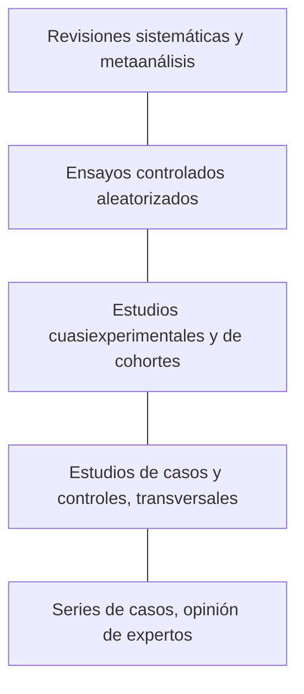

# Capítulo 1. Qué son los antecedentes y por qué buscarlos

**En este capítulo vas a aprender:**

- qué se entiende por *antecedentes* en un trabajo de investigación y en qué se diferencian del marco teórico;
- para qué sirve buscarlos;
- qué tipos de documentos existen y cuánto pesa cada uno;
- qué diferencia hay entre una búsqueda exploratoria y una búsqueda sistemática.

---

## 1.1 Una definición de trabajo

Los **antecedentes** son las investigaciones previas que abordaron el mismo problema que queremos estudiar o problemas muy cercanos. Responden a la pregunta: *¿qué se sabe ya sobre esto y cómo se llegó a saberlo?*

En muchos proyectos, tesinas y tesis los antecedentes forman un apartado propio, separado del **marco teórico**:

| | Antecedentes | Marco teórico |
|---|---|---|
| **Qué contiene** | Estudios concretos: quién investigó, con qué muestra, con qué método, qué encontró. | Conceptos, teorías y modelos que dan sentido al problema. |
| **Pregunta que responde** | ¿Qué se investigó ya? | ¿Desde qué perspectiva miro el problema? |
| **Ejemplo (caso guía; el estudio es ficticio)** | "Un ensayo con 120 estudiantes de Chile encontró que un programa de ocho semanas de *mindfulness* redujo el estrés percibido…" | "El modelo transaccional del estrés de Lazarus y Folkman entiende el estrés como…" |

En la práctica, los dos apartados se alimentan de la misma búsqueda bibliográfica, y algunas instituciones los integran en un único capítulo ("estado del arte", "revisión de la literatura"). Revisá siempre qué pide tu reglamento o tu docente.

> [!NOTE]
> **Estado del arte, estado de la cuestión, revisión de la literatura.** Son expresiones que se usan casi como sinónimos. Todas remiten a un panorama organizado de lo que se sabe sobre un tema en un momento dado.

## 1.2 ¿Para qué sirve buscar antecedentes?

Buscar antecedentes no es un trámite para "llenar" un capítulo. Cumple funciones concretas:

1. **Evitar repetir lo que ya se hizo** o, si se repite, hacerlo a propósito (replicación) y sabiendo por qué.
2. **Identificar vacíos**: poblaciones no estudiadas, contextos poco explorados (por ejemplo, América Latina), resultados contradictorios, métodos que no se probaron.
3. **Justificar el trabajo**: mostrar que la pregunta es pertinente y que la respuesta aporta algo.
4. **Orientar el método**: ver qué diseños, instrumentos y muestras usaron otros, y con qué problemas se encontraron.
5. **Interpretar los resultados propios**: al final del trabajo, la discusión compara lo que encontramos con lo que ya se sabía.
6. **Ubicar la contribución**: decir con precisión en qué se diferencia nuestro trabajo de los anteriores.

> [!IMPORTANT]
> Una buena búsqueda de antecedentes cambia la investigación. Si después de buscar tu pregunta sigue exactamente igual que antes, probablemente buscaste poco o leíste poco.

## 1.3 Tipos de fuentes

### Primarias, secundarias y terciarias

| Tipo | Qué son | Ejemplos |
|---|---|---|
| **Primarias** | Presentan datos o resultados originales. | Artículos empíricos, tesis, informes técnicos con datos propios, actas de congresos con resultados. |
| **Secundarias** | Analizan, resumen o sintetizan fuentes primarias. | Revisiones narrativas, revisiones sistemáticas, metaanálisis, libros de texto. |
| **Terciarias** | Ayudan a encontrar y ubicar las anteriores. | Enciclopedias, diccionarios especializados, bases de datos, catálogos, directorios de revistas. |

Para los antecedentes interesan sobre todo las fuentes **primarias** (qué encontró cada estudio) y las **revisiones** (qué dice el conjunto de estudios). Las terciarias sirven para orientarse al principio.

### Tipos de documentos académicos

- **Artículo empírico (original).** Presenta una investigación con datos propios. Suele tener la estructura IMRyD: Introducción, Método, Resultados y Discusión.
- **Artículo de revisión.** Sintetiza investigaciones previas. Puede ser narrativo, sistemático, de alcance (*scoping*) o un metaanálisis (capítulo 8).
- **Artículo teórico o ensayo.** Propone o discute conceptos y modelos sin datos nuevos.
- **Libro y capítulo de libro.** Útiles para el marco teórico y para temas de humanidades y ciencias sociales, donde el libro sigue siendo un formato central.
- **Tesis de posgrado.** Suelen tener revisiones de antecedentes muy completas y son una fuente excelente de referencias. Muchas están en repositorios de acceso abierto.
- **Actas de congresos (*proceedings*).** Muy importantes en informática e ingeniería, donde muchos resultados se publican primero (o solo) en congresos.
- **Preprints.** Artículos difundidos antes de la revisión por pares. Son útiles para estar al día, pero hay que leerlos con más cautela (capítulo 11).
- **Literatura gris.** Documentos producidos fuera de los circuitos editoriales comerciales: informes de gobiernos y organismos internacionales, documentos de trabajo, tesis, normas técnicas. Se ve en detalle en el capítulo 9.

### La revisión por pares

La mayoría de las revistas académicas someten los artículos a **revisión por pares** (*peer review*): especialistas evalúan el trabajo antes de que se publique. No es garantía de verdad —hay artículos revisados con errores y artículos retractados—, pero es un filtro de calidad mínimo. Muchas bases de datos permiten limitar los resultados a publicaciones revisadas por pares.

## 1.4 No todas las fuentes pesan igual

Cuando la pregunta es sobre la **efectividad de una intervención** (¿funciona este tratamiento, este programa, esta estrategia didáctica?), suele usarse una jerarquía de la evidencia:

Arriba están los diseños que controlan mejor los sesgos. Pero esta jerarquía tiene límites:

- **Sirve para preguntas de efectividad**, no para todas. Si la pregunta es cómo viven los docentes la enseñanza remota, un buen estudio cualitativo es más valioso que un ensayo aleatorizado.
- **El diseño no garantiza la calidad.** Un ensayo mal hecho puede valer menos que un estudio observacional bien hecho.
- **Una revisión sistemática es tan buena como los estudios que incluye** y como la búsqueda que la sostiene.

> [!TIP]
> Si al empezar encontrás una **revisión sistemática reciente** sobre tu tema, tenés un tesoro: te da un panorama, una lista de estudios ya evaluados y, casi siempre, la cadena de búsqueda que usaron los autores. Buscar revisiones primero es una de las mejores estrategias iniciales.

## 1.5 Búsqueda exploratoria y búsqueda sistemática

No todas las búsquedas tienen el mismo objetivo. Conviene distinguir dos extremos:

| | Búsqueda exploratoria | Búsqueda sistemática |
|---|---|---|
| **Objetivo** | Orientarse, conocer el tema, encontrar "algo bueno". | Encontrar **todo** lo relevante sobre una pregunta precisa. |
| **Cuándo** | Al inicio de cualquier trabajo. | En revisiones sistemáticas y de alcance; en tesis que lo requieran. |
| **Cómo** | Pocas palabras, Google Académico, una o dos bases, seguir referencias. | Pregunta estructurada, cadena de búsqueda compleja, varias bases, criterios explícitos. |
| **Documentación** | Mínima (aunque conviene anotar). | Completa y reproducible; se reporta con PRISMA. |

Entre los dos extremos hay un continuo. Un trabajo final de grado suele necesitar algo intermedio: una búsqueda **estructurada y documentada**, sin todas las exigencias de una revisión sistemática formal. En el capítulo 8 llamamos a esto *revisión sistematizada*.

Este libro sigue ese recorrido: primero las herramientas para explorar, después las técnicas para buscar de forma estructurada y, finalmente, los estándares de la búsqueda sistemática.

---

## Resumen

- Los antecedentes son las investigaciones previas sobre nuestro problema; el marco teórico son los conceptos desde los que lo miramos.
- Buscar antecedentes sirve para no repetir, encontrar vacíos, justificar, orientar el método e interpretar resultados.
- Hay fuentes primarias, secundarias y terciarias, y muchos tipos de documentos. Las revisiones sistemáticas son un buen punto de partida.
- La jerarquía de la evidencia es útil para preguntas de efectividad, pero no reemplaza el juicio sobre la calidad de cada estudio.
- La búsqueda puede ser exploratoria o sistemática; la mayoría de los trabajos estudiantiles necesitan algo intermedio, pero siempre documentado.

## Actividad

1. Escribí en dos o tres líneas el tema sobre el que tenés que buscar antecedentes.
2. Buscalo en Google Académico agregando la palabra *revisión* o *review* (por ejemplo: `mindfulness estrés universitarios revisión`).
3. Elegí un resultado y clasificalo: ¿es fuente primaria o secundaria? ¿Qué tipo de documento es? ¿Tiene revisión por pares? ¿Cómo lo sabés?

---

[← Presentación](00-presentacion.md) · [Índice](../README.md) · [Capítulo 2 →](02-planificar.md)
