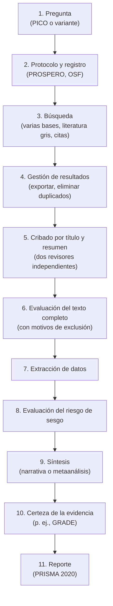
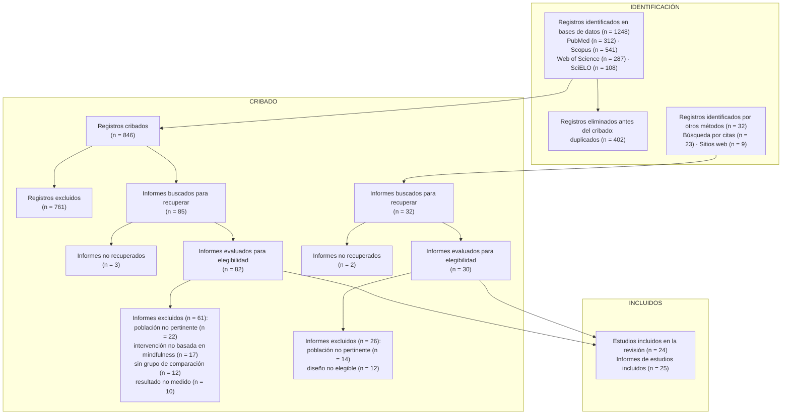

# Capítulo 8. Revisiones sistemáticas y la declaración PRISMA

**En este capítulo vas a aprender:**

- qué tipos de revisiones de la literatura existen y en qué se diferencian;
- cuáles son las etapas de una revisión sistemática;
- qué es PRISMA 2020, qué exige y cómo se arma el diagrama de flujo;
- qué extensiones de PRISMA existen (PRISMA-S, PRISMA-ScR, PRISMA-P);
- qué herramientas facilitan el cribado y la evaluación de estudios;
- qué versión "posible" de revisión sistemática es realista para un trabajo de grado.

---

## 8.1 Tipos de revisiones

"Revisión de la literatura" es un término paraguas. Grant y Booth (2009) identificaron catorce tipos distintos. Los más relevantes para estudiantes:

| Tipo | Objetivo | Búsqueda | Evaluación de calidad | Síntesis |
|---|---|---|---|---|
| **Narrativa (tradicional)** | Panorama de un tema | No necesariamente exhaustiva ni explícita | Opcional | Narrativa, a criterio del autor |
| **Sistemática** | Responder una pregunta precisa con toda la evidencia disponible | Exhaustiva, explícita, reproducible | Sí, con herramientas formales | Narrativa estructurada o metaanálisis |
| **Metaanálisis** | Combinar estadísticamente los resultados de varios estudios | Como la sistemática (suele ser parte de ella) | Sí | Estadística |
| **De alcance (*scoping review*)** | Mapear qué se investigó sobre un tema amplio y detectar vacíos | Exhaustiva | Generalmente no | Mapa, tablas, categorías |
| **Rápida (*rapid review*)** | Dar una respuesta en poco tiempo (por ejemplo, para una decisión política) | Simplificada y declarada | Simplificada | Narrativa |
| **Paraguas (*umbrella review*)** | Sintetizar revisiones sistemáticas existentes | En bases de revisiones | Sí (de las revisiones) | Narrativa o estadística |
| **Sistematizada** | Aplicar elementos del método sistemático con recursos limitados (típica de tesis) | Estructurada y documentada, pero acotada | Parcial | Narrativa |

> [!NOTE]
> **Revisión sistemática no es sinónimo de "revisión con muchas referencias".** Lo que la define es el **método**: una pregunta explícita, una búsqueda reproducible, criterios de selección fijados de antemano, evaluación de la calidad de los estudios y una síntesis transparente.

## 8.2 Etapas de una revisión sistemática

### 1. Pregunta

Formulada con PICO o alguna de sus variantes (capítulo 7).

### 2. Protocolo y registro

El **protocolo** es un documento escrito **antes** de empezar que describe la pregunta, los criterios de inclusión, las fuentes, la estrategia de búsqueda, el método de selección, la evaluación de calidad y la síntesis prevista. Sirve para evitar decisiones arbitrarias a mitad de camino.

El protocolo se **registra** públicamente:

- **PROSPERO**: registro internacional de revisiones sistemáticas con un resultado relacionado con la salud.
- **OSF Registries** (*Open Science Framework*): para cualquier disciplina, incluidas las revisiones de alcance.

Para redactar el protocolo existe la guía **PRISMA-P** (Moher et al., 2015).

### 3. Búsqueda

Todo lo visto en los capítulos 3 a 6, más la búsqueda por citas y la literatura gris (capítulo 9). En una revisión sistemática se espera:

- varias bases de datos, incluidas las disciplinares con tesauro;
- estrategias adaptadas a cada base y **reportadas completas**;
- búsqueda en español, inglés y otros idiomas pertinentes, o una justificación si no se hace;
- registro de la fecha de cada búsqueda;
- idealmente, revisión de la estrategia por un bibliotecario (guía PRESS, capítulo 5).

### 4. Gestión de resultados

Los resultados de todas las bases se exportan (en formato RIS, BibTeX u otro) a un gestor bibliográfico o a una herramienta de cribado, y se **eliminan los duplicados**. Hay que anotar cuántos registros vinieron de cada fuente y cuántos duplicados se quitaron: esos números van al diagrama PRISMA.

### 5. Cribado por título y resumen

Se leen títulos y resúmenes y se decide, con los criterios de inclusión en la mano, si cada registro:

- **se excluye** (claramente no cumple los criterios);
- **pasa** a la siguiente etapa (cumple o hay dudas).

> [!TIP]
> **En caso de duda, se incluye.** En el cribado por título y resumen, el error más costoso es excluir un estudio relevante: ya no vuelve a aparecer. Un estudio dudoso que pasa se descarta después con el texto completo.

Buenas prácticas:

- **Prueba piloto**: antes de empezar, dos personas criban el mismo conjunto de 50 a 100 registros y comparan decisiones para afinar la interpretación de los criterios.
- **Doble revisión independiente**: dos personas criban por separado y luego resuelven los desacuerdos por consenso o con una tercera persona.
- **Acuerdo entre revisores**: suele medirse con el coeficiente **kappa de Cohen** (Cohen, 1960). Como orientación, valores entre 0,61 y 0,80 se consideran un acuerdo sustancial y por encima de 0,80, casi perfecto (Landis y Koch, 1977).

### 6. Evaluación del texto completo

Se consiguen los textos completos de los registros que pasaron el cribado y se leen para tomar la decisión final. Ahora **cada exclusión se registra con su motivo** (población no pertinente, sin grupo control, etc.), porque PRISMA pide reportarlos.

### 7. Extracción de datos

Con una planilla diseñada de antemano (y probada con dos o tres estudios), se extraen los datos de cada estudio incluido: autores, año, país, diseño, muestra, intervención, comparación, instrumentos, resultados, financiamiento, etc. La matriz del [Anexo A](../anexos/A-plantillas.md) es un buen punto de partida.

### 8. Evaluación del riesgo de sesgo o de la calidad

Se evalúa con herramientas específicas para cada diseño:

| Diseño de los estudios incluidos | Herramientas frecuentes |
|---|---|
| Ensayos controlados aleatorizados | RoB 2 (Sterne et al., 2019) |
| Estudios no aleatorizados de intervenciones | ROBINS-I |
| Estudios observacionales (cohortes, casos y controles) | Escala Newcastle-Ottawa, listas de JBI |
| Estudios cualitativos | CASP, listas de JBI |
| Estudios de métodos mixtos | MMAT (Hong et al., 2018) |
| Revisiones sistemáticas | AMSTAR 2 |

### 9. Síntesis

- **Síntesis narrativa estructurada**: se agrupan los estudios (por tipo de intervención, población, resultado) y se describen patrones, coincidencias y contradicciones. Existe una guía de reporte para síntesis sin metaanálisis: **SWiM**.
- **Metaanálisis**: si los estudios son suficientemente homogéneos, se combinan estadísticamente sus resultados.

### 10. Certeza de la evidencia

En salud se usa el sistema **GRADE** para juzgar cuánta confianza merece cada conclusión (alta, moderada, baja o muy baja), considerando el riesgo de sesgo, la inconsistencia, la imprecisión, la evidencia indirecta y el sesgo de publicación.

### 11. Reporte

Se escribe siguiendo **PRISMA 2020**, que vemos a continuación.

## 8.3 ¿Qué es PRISMA?

**PRISMA** (*Preferred Reporting Items for Systematic reviews and Meta-Analyses*) es una **guía de reporte**: indica qué información tiene que contener el informe de una revisión sistemática para que los lectores puedan entender qué se hizo, evaluarlo y reproducirlo. Su versión vigente es **PRISMA 2020** (Page et al., 2021a), que actualizó la de 2009. Existe una traducción oficial al español (Page et al., 2021b).

> [!IMPORTANT]
> **PRISMA no es un método para hacer revisiones: es una guía para contarlas.** Cumplir con PRISMA no garantiza que una revisión sea buena; garantiza que el lector puede juzgar si lo es. Para el *cómo hacer*, las referencias son manuales como el *Cochrane Handbook* (Higgins et al., 2024) o el *JBI Manual for Evidence Synthesis* (Aromataris et al., 2024).

PRISMA 2020 tiene tres componentes principales:

1. **Lista de verificación de 27 ítems** (con subítems), organizada en siete secciones.
2. **Lista de verificación para resúmenes** (*PRISMA 2020 for Abstracts*, 12 ítems).
3. **Diagrama de flujo**, que muestra cuántos registros se identificaron, cribaron, excluyeron e incluyeron.

## 8.4 La lista de verificación PRISMA 2020

Un resumen de las secciones y los ítems más importantes para quien busca:

| Sección | Ítems | Qué se reporta (resumido) |
|---|---|---|
| **Título** | 1 | Identificar el trabajo como revisión sistemática. |
| **Resumen** | 2 | Resumen estructurado según PRISMA para resúmenes. |
| **Introducción** | 3-4 | Justificación y objetivos o preguntas (idealmente con PICO). |
| **Métodos** | 5-15 | Criterios de elegibilidad; **fuentes de información** con la fecha de la última búsqueda (ítem 6); **estrategia de búsqueda completa** para todas las bases, registros y sitios, con filtros y límites (ítem 7); proceso de selección (ítem 8); extracción de datos; evaluación del riesgo de sesgo; métodos de síntesis; evaluación del sesgo de reporte y de la certeza de la evidencia. |
| **Resultados** | 16-22 | **Selección de estudios con diagrama de flujo** (ítem 16), incluidos los estudios que parecían cumplir los criterios pero se excluyeron, y por qué; características de los estudios; riesgo de sesgo; resultados individuales y de las síntesis. |
| **Discusión** | 23 | Interpretación, limitaciones de la evidencia y de la revisión, implicancias. |
| **Otra información** | 24-27 | Registro y protocolo; financiamiento; conflictos de interés; disponibilidad de datos, código y materiales. |

La lista completa, con su documento de explicación y ejemplos, está disponible en el sitio oficial de PRISMA y en la traducción al español.

> [!TIP]
> **Estrategia de búsqueda completa (ítem 7).** "Completa" significa **la cadena textual, tal como se ejecutó, para cada base**, con los límites aplicados. No alcanza con decir "se usaron los términos *mindfulness* y *estrés*". Por eso la bitácora del capítulo 2 es tan importante: es la materia prima de este ítem. Lo habitual es poner las cadenas en un anexo o material suplementario.

## 8.5 El diagrama de flujo PRISMA 2020

El diagrama muestra el recorrido de los registros desde la búsqueda hasta la inclusión. En PRISMA 2020 tiene tres fases —**identificación**, **cribado** e **inclusión**— y puede tener dos columnas: una para bases de datos y registros, y otra para otros métodos (búsqueda por citas, sitios web, organizaciones).

Ejemplo con los números del caso guía:

Cómo leer los números:

- 1.248 registros − 402 duplicados = **846** registros cribados.
- 846 cribados − 761 excluidos por título y resumen = **85** informes buscados.
- 85 − 3 no recuperados = **82** evaluados a texto completo; 82 − 61 excluidos = **21** informes incluidos desde las bases.
- Por otros métodos: 32 − 2 no recuperados = 30 evaluados; 30 − 26 excluidos = **4** informes incluidos.
- Total: 21 + 4 = **25 informes**, que corresponden a **24 estudios** (un estudio se publicó en dos artículos).

> [!NOTE]
> **Registros, informes y estudios.** PRISMA 2020 distingue tres unidades: un **registro** es una referencia en una base de datos (título, resumen); un **informe** es un documento (artículo, tesis, informe técnico) que describe un estudio; un **estudio** es la investigación en sí, que puede estar publicada en varios informes. Por eso el último recuadro puede tener dos números distintos.

> [!TIP]
> **Herramientas para dibujar el diagrama.** El sitio oficial de PRISMA ofrece plantillas editables. También existe una aplicación web gratuita basada en el paquete *PRISMA2020* de R (Haddaway et al., 2022) que genera el diagrama a partir de los números. Y herramientas como Rayyan o Covidence llevan la cuenta automáticamente.

> [!WARNING]
> **Error frecuente: números que no cierran.** Revisá que cada recuadro sea la resta exacta del anterior. Los evaluadores lo verifican y un diagrama con cuentas que no cierran genera desconfianza sobre todo el trabajo.

## 8.6 Extensiones de PRISMA

PRISMA tiene extensiones para situaciones específicas. Las más útiles para la búsqueda:

| Extensión | Para qué sirve | Referencia |
|---|---|---|
| **PRISMA-S** | Reportar la **búsqueda** en detalle (16 ítems): bases y plataformas, registros de ensayos, búsqueda en sitios web, búsqueda por citas, contacto con autores, estrategias completas, límites, filtros validados, revisión por pares de la búsqueda, actualizaciones, fechas y gestión de duplicados. | Rethlefsen et al. (2021) |
| **PRISMA-P** | Redactar el **protocolo** de una revisión sistemática. | Moher et al. (2015) |
| **PRISMA-ScR** | Reportar **revisiones de alcance** (*scoping reviews*). | Tricco et al. (2018) |
| **PRISMA-NMA** | Metaanálisis en red. | — |
| **PRISMA-DTA** | Revisiones de precisión diagnóstica. | — |
| **PRISMA-Equity** | Revisiones centradas en la equidad. | — |

> [!TIP]
> **PRISMA-S es la mejor lista de control para tu búsqueda**, aunque no hagas una revisión sistemática formal. Si tu sección de método responde a sus ítems, cualquier lector puede reproducir tu búsqueda.

## 8.7 Herramientas para gestionar una revisión

| Tarea | Herramientas |
|---|---|
| Gestión de referencias y duplicados | Zotero, Mendeley, EndNote (capítulo 12) |
| Cribado colaborativo | **Rayyan** (versión gratuita; permite cribado ciego entre revisores; Ouzzani et al., 2016), **Covidence** (suscripción) |
| Cribado asistido por aprendizaje automático | **ASReview** (código abierto; ordena los registros según la probabilidad de ser relevantes a medida que se criban; van de Schoot et al., 2021), funciones de priorización en Rayyan y otras plataformas |
| Extracción de datos | Planillas de cálculo, Covidence, formularios en línea |
| Diagrama de flujo | Plantillas de PRISMA, aplicación *PRISMA2020* |
| Metaanálisis | RevMan (Cochrane), R (paquetes *meta*, *metafor*), JASP, jamovi |
| Registro del protocolo | PROSPERO, OSF Registries |

El uso de inteligencia artificial en estas etapas se discute en el capítulo 10.

## 8.8 ¿Revisión sistemática en un trabajo de grado?

Una revisión sistemática completa requiere, como mínimo, dos revisores, acceso a varias bases de datos y varios meses de trabajo. Para una tesina o un trabajo final, lo más realista suele ser una **revisión sistematizada**: se adoptan los elementos que hacen la búsqueda transparente y reproducible, y se declaran las limitaciones.

| Elemento | Revisión sistemática | Revisión sistematizada (trabajo de grado) |
|---|---|---|
| Pregunta estructurada (PICO) | Sí | **Sí** |
| Protocolo registrado | Sí | Recomendable (aunque sea un documento interno aprobado por el director) |
| Búsqueda en varias bases | Sí, exhaustiva | **Sí**, 3 o 4 bases incluidas regionales |
| Cadenas completas reportadas | Sí | **Sí** |
| Búsqueda en español e inglés | Sí o justificación | **Sí** |
| Criterios de inclusión explícitos | Sí | **Sí** |
| Doble revisión independiente | Sí | Parcial (p. ej., el director revisa una muestra) |
| Evaluación formal del riesgo de sesgo | Sí | Opcional o simplificada |
| Diagrama de flujo PRISMA | Sí | **Sí** |
| Metaanálisis | Si corresponde | Raramente |

> [!IMPORTANT]
> Llamá a tu trabajo por su nombre. Si no hiciste doble revisión ni evaluación del riesgo de sesgo, no es una revisión sistemática en sentido estricto: es una revisión sistematizada, una revisión de la literatura con búsqueda estructurada, o una revisión de alcance si ese era el objetivo. Declararlo con honestidad fortalece tu trabajo; exagerar el método lo debilita.

---

## Resumen

- Hay muchos tipos de revisiones: narrativas, sistemáticas, metaanálisis, de alcance, rápidas, paraguas y sistematizadas. Lo que las distingue es el método.
- Una revisión sistemática sigue etapas definidas: pregunta, protocolo, búsqueda, cribado, evaluación, extracción, riesgo de sesgo, síntesis, certeza y reporte.
- PRISMA 2020 es una guía para **reportar** revisiones: 27 ítems, una lista para resúmenes y un diagrama de flujo en tres fases (identificación, cribado, inclusión).
- PRISMA-S detalla cómo reportar la búsqueda y es útil para cualquier trabajo; PRISMA-P sirve para protocolos y PRISMA-ScR para revisiones de alcance.
- En un trabajo de grado, una revisión sistematizada bien documentada es una meta realista y valiosa.

## Actividad

1. Buscá una revisión sistemática publicada sobre tu tema y ubicá: la pregunta, las bases usadas, la cadena de búsqueda completa y el diagrama de flujo. ¿Cumple con el ítem 7 de PRISMA (estrategia completa)?
2. Verificá las cuentas de su diagrama de flujo.
3. Redactá un mini protocolo de una página para tu propia búsqueda: pregunta PICO, criterios de inclusión y exclusión, bases de datos, idiomas, período y plan de selección.
4. Con los resultados de tu búsqueda (aunque sea preliminar), armá un diagrama de flujo PRISMA.

---

[← Capítulo 7](07-pregunta-pico.md) · [Índice](../README.md) · [Capítulo 9 →](09-busqueda-por-citas.md)
